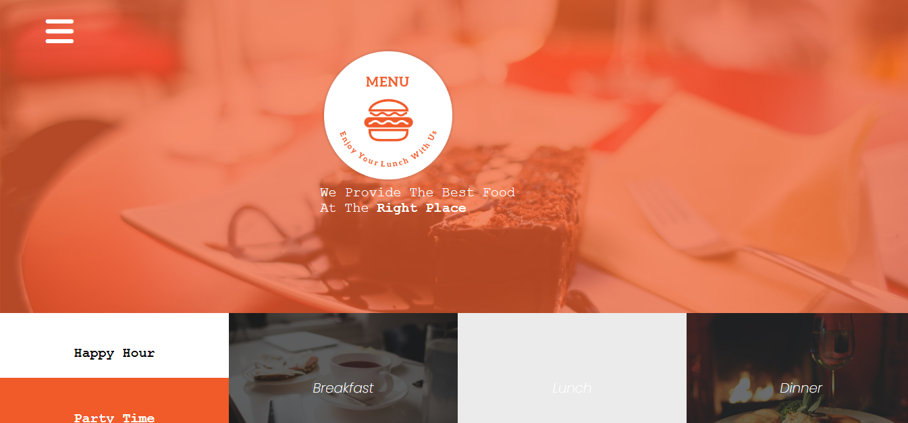
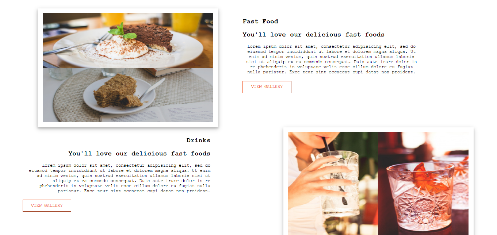
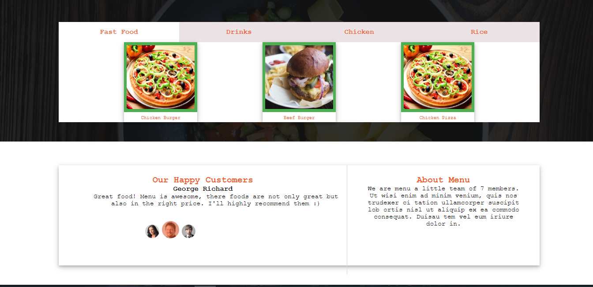
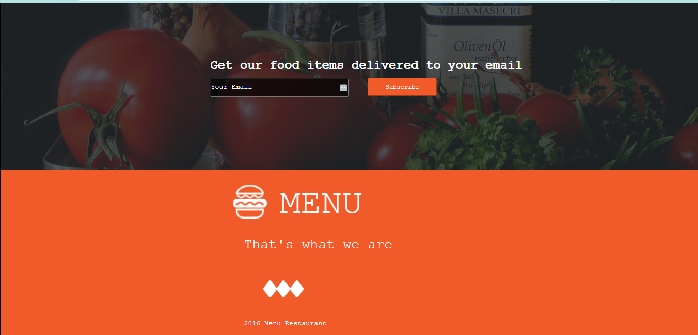

# Anita's Restaurant
This is a project built to illustrate a Restaurant.

It includes dishes, descriptions and preview of some beneficials of the Restaurant.

To have a better view, you can preview the website through the link below.

```

```

## Technologies
I used the following tools to achieve completion of my website.

1. HTML 5
2. CSS 3
3. Java Script
4. Mark Down

## Pre-requisites
In order to run the applicaion, you'll need the following resources with you:

- Linux / Windows / MaCos
- 2GB RAM
- 4GB free space
- Browser i.e Edge 12, Firefox 4, Safari 5, Chrome 3, IE 9, Opera 10.

## SetUp
This section will guide you on how you can set the application on you local machine.

- Clone the repository to your local machine.

On your `Terminal` (**Linux** / **MaCos**) or `GitBash` / `WSL` (**Windows**).

```
git clone : https://github.com/morrismutiso/project-04
```
- Change into the working directory

```
cd project-04.readme
```
- Open Visual Studio Code on your machine
```
code .
```

- Then Run it on the browser by opening it through live server on the VsCode.

## Screens
- First

- second

-Third

- Fourth


## Author
This project was built and is managed by:
```
[morrismutiso](https://github.com/morrismutiso)
```
## Known issues
There are no known issues at the current moment.

## License
This website has been distributed under the MIT LICENSE as follows:

Copyright (c) 2012-2023 Scott Chacon and others

Permission is hereby granted, free of charge, to any person obtaining
a copy of this software and associated documentation files (the
"Software"), to deal in the Software without restriction, including
without limitation the rights to use, copy, modify, merge, publish,
distribute, sublicense, and/or sell copies of the Software, and to
permit persons to whom the Software is furnished to do so, subject to
the following conditions:

The above copyright notice and this permission notice shall be
included in all copies or substantial portions of the Software.

THE SOFTWARE IS PROVIDED "AS IS", WITHOUT WARRANTY OF ANY KIND,
EXPRESS OR IMPLIED, INCLUDING BUT NOT LIMITED TO THE WARRANTIES OF
MERCHANTABILITY, FITNESS FOR A PARTICULAR PURPOSE AND
NONINFRINGEMENT. IN NO EVENT SHALL THE AUTHORS OR COPYRIGHT HOLDERS BE
LIABLE FOR ANY CLAIM, DAMAGES OR OTHER LIABILITY, WHETHER IN AN ACTION
OF CONTRACT, TORT OR OTHERWISE, ARISING FROM, OUT OF OR IN CONNECTION
WITH THE SOFTWARE OR THE USE OR OTHER DEALINGS IN THE SOFTWARE.
